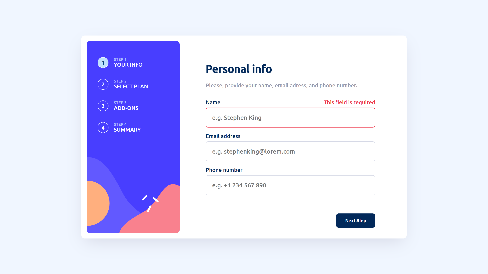

# Frontend Mentor - Multi-step form solution

This is a solution to the [Multi-step form challenge on Frontend Mentor](https://www.frontendmentor.io/challenges/multistep-form-YVAnSdqQBJ). Frontend Mentor challenges help you improve your coding skills by building realistic projects. 

## Table of contents

- [Overview](#overview)
  - [The challenge](#the-challenge)
  - [Screenshot](#screenshot)
  - [Links](#links)
- [My process](#my-process)
  - [Built with](#built-with)
  - [What I learned](#what-i-learned)
  - [Continued development](#continued-development)
  - [Useful resources](#useful-resources)
- [Author](#author)
- [Acknowledgments](#acknowledgments)


## Overview

### The challenge

Users should be able to:

- Complete each step of the sequence
- Go back to a previous step to update their selections
- See a summary of their selections on the final step and confirm their order
- View the optimal layout for the interface depending on their device's screen size
- See hover and focus states for all interactive elements on the page
- Receive form validation messages if:
  - A field has been missed
  - The email address is not formatted correctly
  - A step is submitted, but no selection has been made

### Screenshot


.png)
.png)
.png)
.png)
.png)
.png)
.png)
.png)
.png)


### Links

- Solution URL: [github](https://github.com/LucasNahuel/angular-multi-step-form)
- Live Site URL: [live at Vercel](https://angular-multi-step-form.vercel.app/)

## My process

### Built with

- HTML5
- CSS custom properties
- CSS media queries 
- Flexbox
- [Angular](https://angular.io/) - front-end development platform


### What I learned

First time i've needed to offset an background image:

```css
.element-with-background-img {

  /* this line defines the center of the background at the middle (50%) and a offset of the bottom of 10% */
  background-position: 50% 90%;
}
```


### Useful resources

- [background-position explanation](https://developer.mozilla.org/en-US/docs/Web/CSS/background-position) - as mentioned above, this helped me understanding this property required to match the solution layout in mobile version.


## Author

- Website - [Lucas Munoz Portfolio](https://angular-portfolio-lake.vercel.app/)
- Frontend Mentor - [@LucasNahuel](https://www.frontendmentor.io/profile/LucasNahuel)

## Acknowledgments

Thanks you for seeing this.
